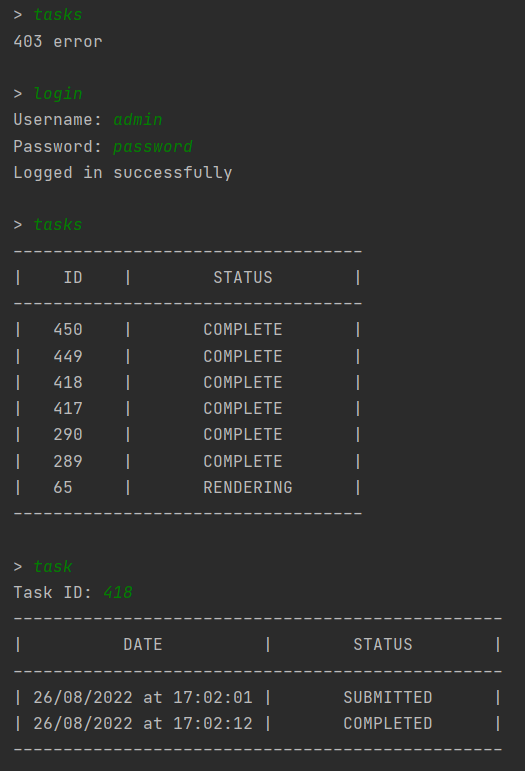
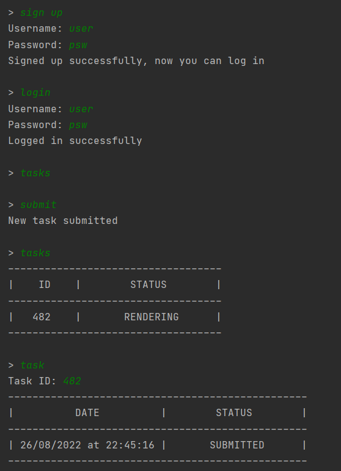

# Render Farm

## Условие

Реализовать прототип рендер фермы на java. Прототип представляет собой
клиент-серверное приложение. Данное приложение требуется в первую очередь
клиентам, которые хотят отслеживать статус своих задач на рендер ферме.

### Клиент
Консольное приложение со следующими возможностями:
* регистрация пользователя
* создание новой задачи 
* отображение списка созданных задач (id, status)
* отображение истории смены статусов задачи

### Сервер
Принимает от клиента запросы и обрабатывает их.
* Регистрация пользователя с занесением его в базу данных.
* Создание новой задачи для конкретного пользователя с занесением ее в
   базу данных.
* Обработка запроса списка текущих задач.

## Использованные технологии

* **Java 11**
* **Spring Framework** (Boot, Data, Security)
* **H2 Database** (file-based)
* **Liquibase** - версионирование БД
* **JJWT** - работа с JWT токенами
* **JUnit, AssertJ** - тестирование

## Пример работы

Пример работы клиента при запущеном локально сервере:

  |  
:-------------------------:|:-------------------------:
